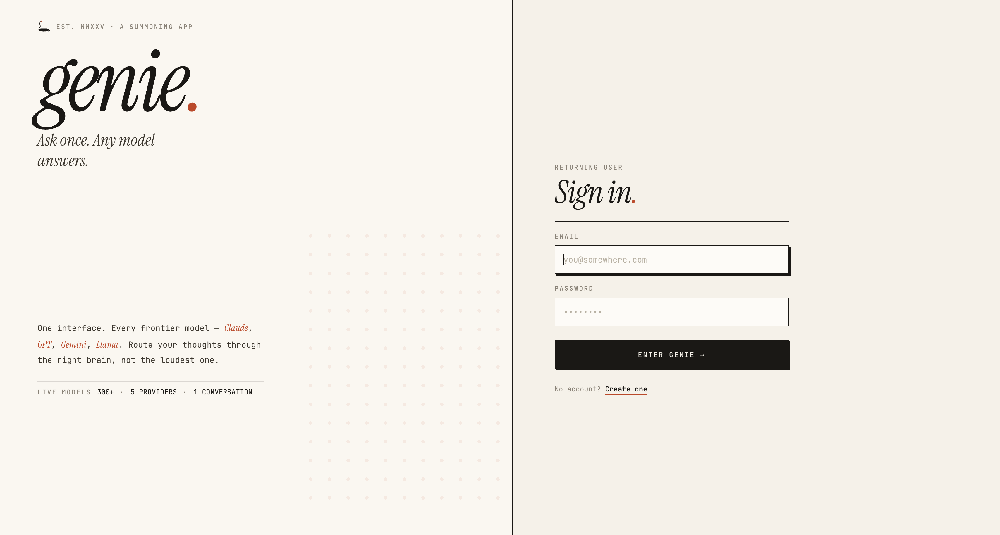
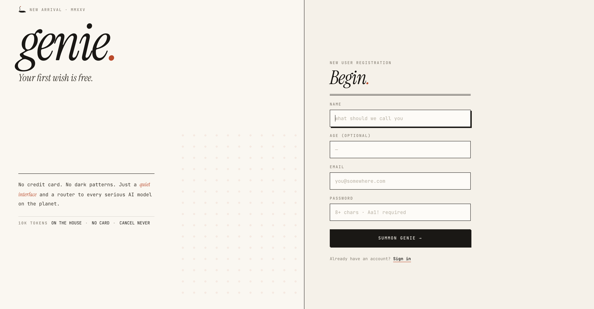
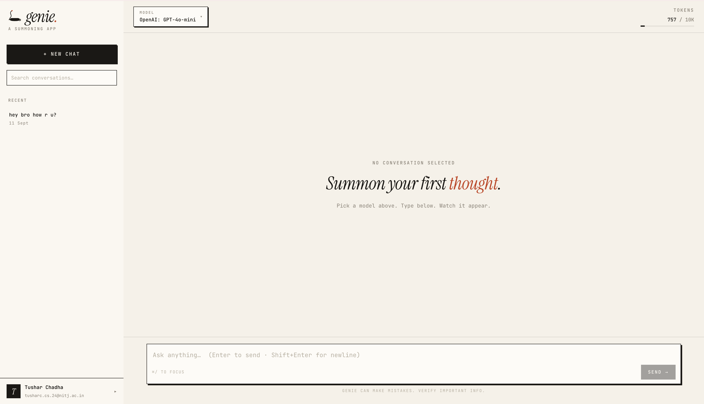
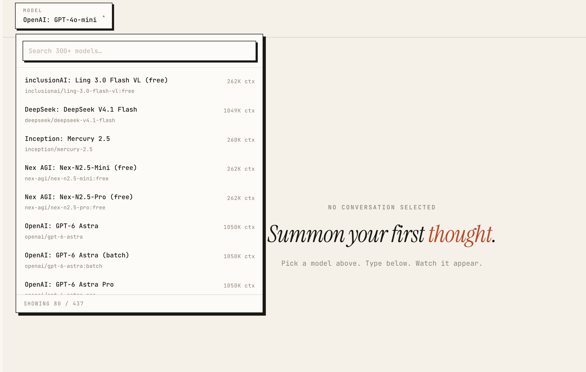
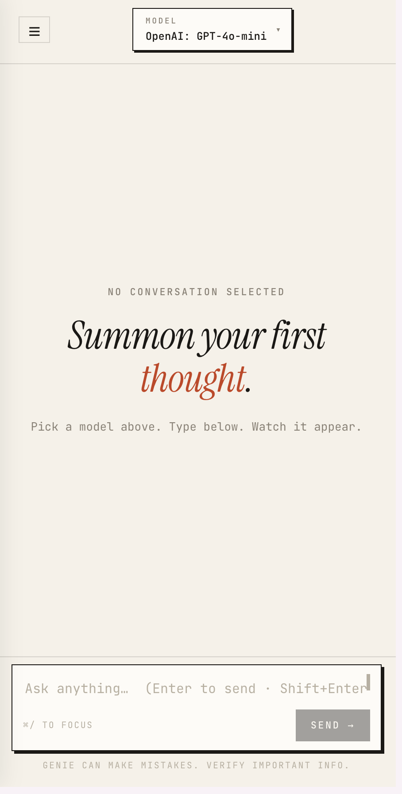

# genie.

> One interface. Every frontier AI model.

A minimal, editorial-style chat client that routes your prompts to any of 300+ models on OpenRouter. Built with React, Express, MongoDB, and Redis.

---

## Screenshots

### Landing


### Sign up


### Chat with markdown + code


### Model picker


### Mobile


---

## Features

**Authentication**
- Email + password signup with Zod-validated input
- JWT in httpOnly cookies (blocklist on logout via Redis)
- Auto-session restore via `/user/profile`

**Chat**
- Markdown rendering with GFM support
- Code blocks with syntax highlighting + copy button
- Auto-titled chats (first message becomes the title)
- Auto-summarization after 20 messages to keep context tight
- Per-chat and per-user token usage tracking
- Search across chat history
- Copy any message with one click
- Delete chats from sidebar or header

**Models**
- Live list of 300+ OpenRouter models via a server-side proxy
- Search + filter by name or ID
- Context window shown per model
- Model choice persisted in localStorage

**Infrastructure**
- Rate limiting per user and per IP via Redis
- Token usage window (10K tokens / 5 hours per user)
- MongoDB indexes on hot query paths
- PWA manifest — installable on desktop and mobile
- Fully responsive with mobile sidebar drawer

---

## Tech Stack

| Layer | Tech |
|---|---|
| Frontend | React, Vite, React Router, react-markdown |
| Backend | Node.js, Express |
| Database | MongoDB (Mongoose) |
| Cache / Rate limiting | Redis |
| AI Gateway | OpenRouter SDK |
| Auth | JWT (httpOnly cookie) + bcrypt |
| Validation | Zod |

---

## Architecture

- **Frontend (React + Vite)** — runs on port 5173, serves the Paper Terminal UI
- **Backend (Express)** — runs on port 3000, handles auth, rate limiting, chat persistence
- **MongoDB** — stores users, chats, and messages with compound indexes on hot paths
- **Redis** — sessions blocklist, rate limit counters, and rolling token usage windows
- **OpenRouter** — single gateway to 300+ models, called from the backend only

**Key design decisions:**

- **Server-side OpenRouter proxy** — the API key never touches the browser
- **Redis blocklist for logout** — JWTs stay stateless, revocation is instant
- **Rolling token window** — per-user limits protect cost without per-chat friction
- **Chat summarization** — older messages are compressed every 20 turns, keeping context cheap

---

## Running Locally

### Prerequisites
- Node.js 18+
- MongoDB (local or Atlas)
- Redis (local or Upstash)
- OpenRouter API key ([get one](https://openrouter.ai/keys))

### Backend

```bash
cd Backend/CHATGPT PROJECT
npm install
```

Create a `.env` file in `Backend/CHATGPT PROJECT/` with:

```env
PORT=3000
MONGODB_URL=your_mongodb_connection_string
REDIS_URL=your_redis_url
JWT_SECRET=generate_a_long_random_string
OPENROUTER_API_KEY=sk-or-v1-...
DEFAULT_AI_MODEL=openai/gpt-4o-mini
TOKEN_LIMIT=10000
TOKEN_WINDOW_SECONDS=18000
```

Then start the server:

```bash
nodemon index.js
```

### Frontend

```bash
cd Frontend
npm install
npm run dev
```

Open [http://localhost:5173](http://localhost:5173).

---

## API Endpoints

### Auth
| Method | Path | Purpose |
|---|---|---|
| POST | `/user/signup` | Create account |
| POST | `/user/login` | Login, sets cookie |
| POST | `/user/logout` | Revokes JWT |
| GET | `/user/profile` | Get current user |
| DELETE | `/user/delete` | Delete account + all data |

### Chats
| Method | Path | Purpose |
|---|---|---|
| GET | `/chat/getRecentChat` | Last 20 chats |
| GET | `/chat/:id` | Single chat metadata |
| POST | `/chat/createChat` | Create empty chat |
| DELETE | `/chat/:id` | Delete chat + messages |

### Messages
| Method | Path | Purpose |
|---|---|---|
| GET | `/msg/:chatId` | Load messages for chat |
| POST | `/msg/` | New chat + first message |
| POST | `/msg/:chatId` | Reply in existing chat |

### Models
| Method | Path | Purpose |
|---|---|---|
| GET | `/models` | List of available OpenRouter models |

---

## What I'd Do Next

- **Streaming responses** via SSE (currently full-response)
- **Branching** — edit a past message and fork the conversation
- **Local embeddings** for semantic search across chat history
- **Multi-model compare** — send one prompt to N models side-by-side
- **SQLite** backend option for zero-config deploys

---

## License

All Rights Reserved.

This code is publicly viewable for portfolio and educational purposes only.
No permission is granted to copy, modify, distribute, or use this code,
in whole or in part, for any purpose without explicit written permission
from the author.